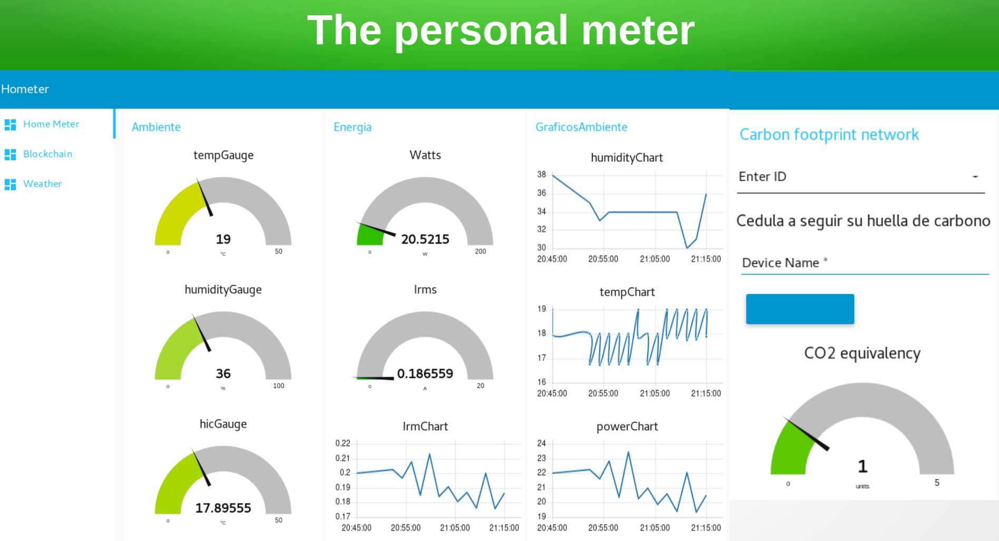

# Hometer

  

Measurement of carbon footprint in homes and calculating in a reliable way in a distributed blockchain.  The variables to measure includes but not limited to energy, water consumption, CO/CO2.

*Read this in other languages: [English](README.md), [Español](README.es_co.md).*

## Contents

1. [Short description](#short-description)
1. [Demo video](#demo-video)
1. [The architecture](#the-architecture)
1. [Long description](#long-description)
1. [Project roadmap](#project-roadmap)
1. [Getting started](#getting-started)
1. [Running the tests](#running-the-tests)
1. [Live demo](#live-demo)
1. [Built with](#built-with)
1. [Contributing](#contributing)
1. [Versioning](#versioning)
1. [Authors](#authors)
1. [License](#license)

## Short description

### What's the problem?

The calculation of carbon footprint is not the same for all the locations and human activities, it depends on how the energy or water is produced (is different for example for hydraulic than gas generators), and could be subject to human intervention.

We considered the measurement should be obtained by home automation and the carbon footprint must be calculated taking into account the aspects related with the conditions used to do this calculation.  All the aspects considered need to be validated by the participants and registered in a blockchain in order to have a realistic and reliable carbon 

### How can technology help?

The IoT devices to be used at home need to provide some aditional value than being only sensors, and be able to read and send the data in an automated way.

### The idea

The IoT devices used at home or work need to be non intrusive and cost efficient, the data collected by the devices need to be integrated with calculations depending on the location of the sensor and all the calculation need to count for the home of office account owner; so we have several actors updating the ledger for carbon footprint.  The hometer network provides all of this capabilities.

## Demo video

## The architecture

1. The device collects consumption info and reports to the IoT network
2. The user can connect to the device by WiFi to get information about configuration and mettering on real time
3. The NodeRed App collects multiple device information and correlates the location of the device to determine the calculation for carbon footprint
4. The user connect to NodeRed dashboard to view historical data consumption and hours of consumption, useful in determining the time of the day and the consumptions in the day.
5. The calculated consumption is sent to hyperledger to create a carbon footprint record for person ledger
6. Peer uses an “endorsement” service to simulate the proposed transaction against the relevant smart contracts. This service confirms that the transaction is possible, given the current state of the ledger. Examples of invalid proposals might be creating an asset that already exists, querying the state of an asset that does not exist, etc.

## Long description

[More detail is available here](docs/index.html)

## Project roadmap

## Getting started

These instructions will get you a copy of the project up and running on your local machine for development and testing purposes. See deployment for notes on how to deploy the project on a live system.

### Prerequisites

For the code of the device you need to install Arduino software (https://www.arduino.cc/en/main/software) and add the necessary modules to work with nodemcu which are the following libraries:

### Installing

For IBM Cloud is necessary to provision IBM Internet of Things to gather info from more than a couple devices and Node-Red starter app.  For local development you can install node.js and node-red using

bash
dnf install nodejs
npm install nodered

And for start node-red instance simply

bash
node-red

## Running the tests

For testing you can configure mqtt.eclipse.org collecting network.  This needs to be modified in watsoniot.h file in arduino code and in MQTT IN node in node red to be referenced in both.  Also we used a device simulator also available in node-red to simulate the device input.

## Live demo

You can find a running system to test at [colnodered.mybluemix.net/](http://colnodered.mybluemix.net/) with user and password admin 

## Built with

* [IBM Cloudant](https://cloud.ibm.com/catalog?search=cloudant#search_results) - The NoSQL database used
* [NodeRed running on IBM CloudFoundry](https://cloud.ibm.com/catalog?search=%22node-red%20app%22#search_results) - The compute platform for handing cloud app logic
* [IBM Internet of Things Platform](https://cloud.ibm.com/catalog?search=internet%20of%20things%20platform#search_results) - The IBM Cloud service to manage the devices network
* [Node-RED Blockchain](https://github.com/johnwalicki/Node-RED-Storm-BlockChain-Demo) - Base code to build Blockchain App and guide to use the APIs

## Contributing

Please read [CONTRIBUTING.md](CONTRIBUTING.md) for details on our code of conduct, and the process for submitting pull requests to us.

## Versioning

We use [GitHub](http://github.com/) for versioning. For the versions available, see the [tags on this repository](https://github.com/rodolfolui/Hometer/tags).

## Authors

* **Daniel Lema** 
* **Rodolfo Vasquez** 

See also the list of [contributors](https://github.com/rodolfolui/Hometer/graphs/contributors) who participated in this project.

## License

This project is licensed under the Apache 2 License - see the [LICENSE](LICENSE) file for details
